### Github配置
- 在terminal中生成ssh key
```sh
ssh-keygen -t rsa -b 4096 -C "<github 注册邮箱>" && cat ~/.ssh/id_rsa.pub.pub
```
- 打开github setting界面
<div style="text-align:center; margin:auto">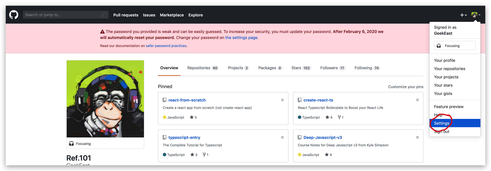</div>

- 添加ssh key
<div style="text-align:center; margin:auto">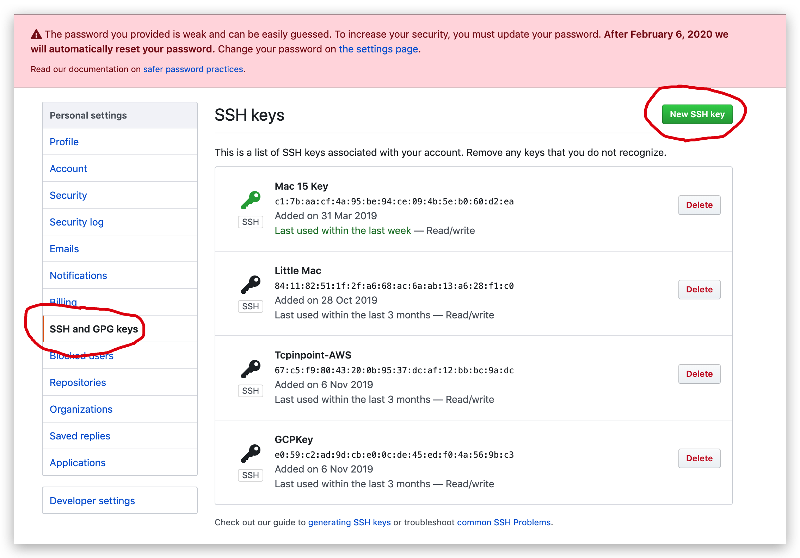</div>

- 把terminal产生的字符串复制粘贴到这里
<div style="text-align:center; margin:auto">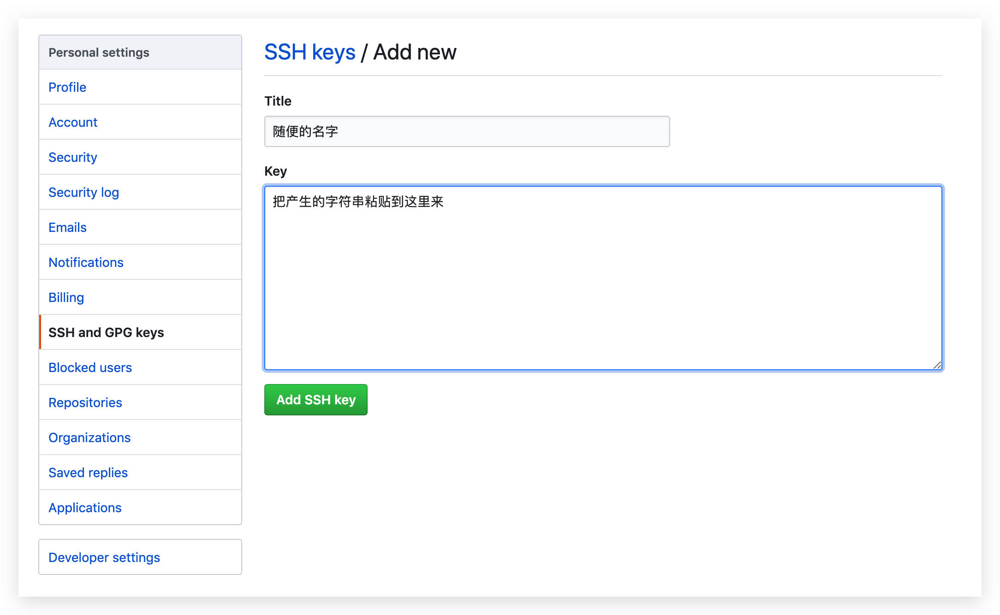</div>

- 点击repository
<div style="text-align:center; margin:auto">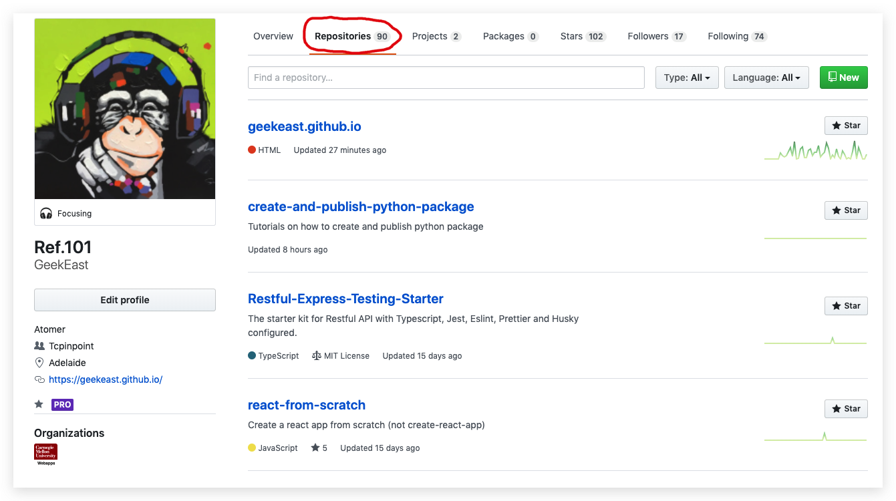</div>

- 点击新建
<div style="text-align:center; margin:auto">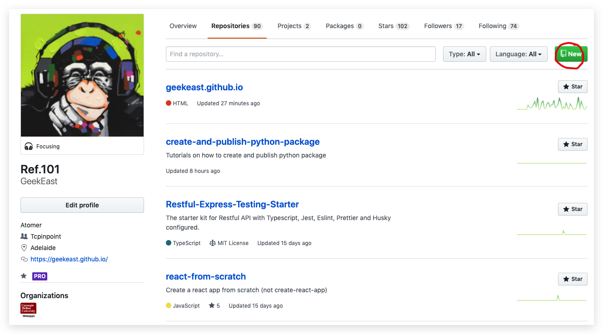</div>

- 照图填写
<div style="text-align:center; margin:auto">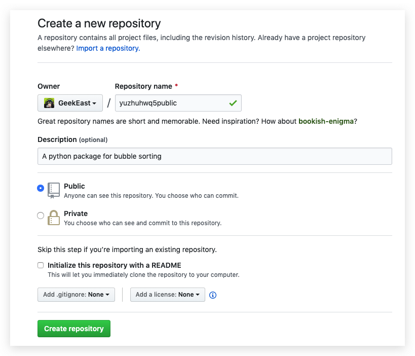</div>

- 在编辑器里记下这两行
<div style="text-align:center; margin:auto">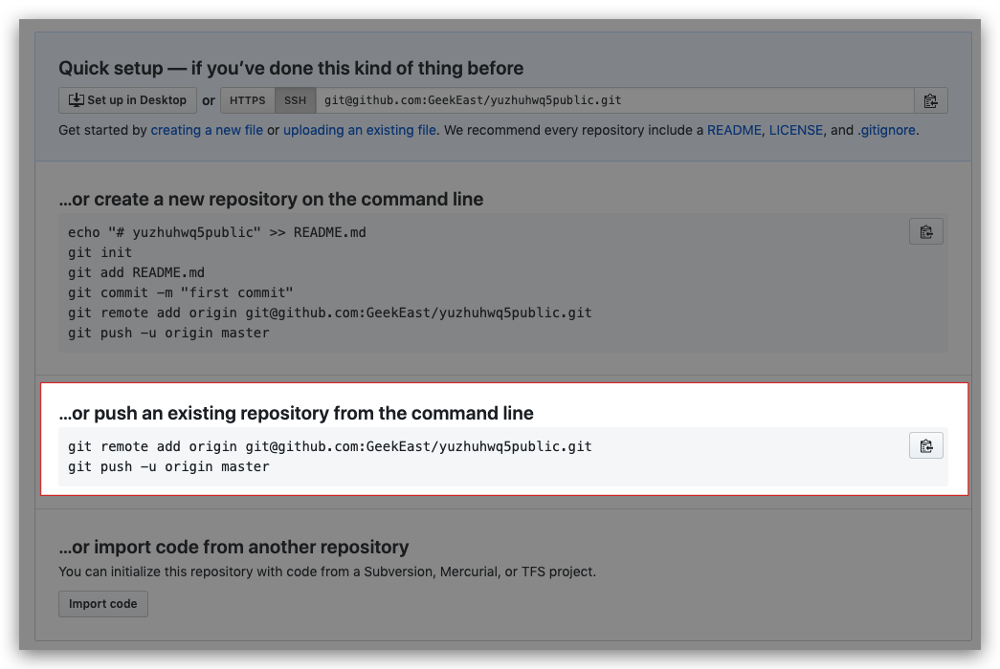</div>


### 项目初始化
- 打开terminal
<div style="text-align:center; margin:auto">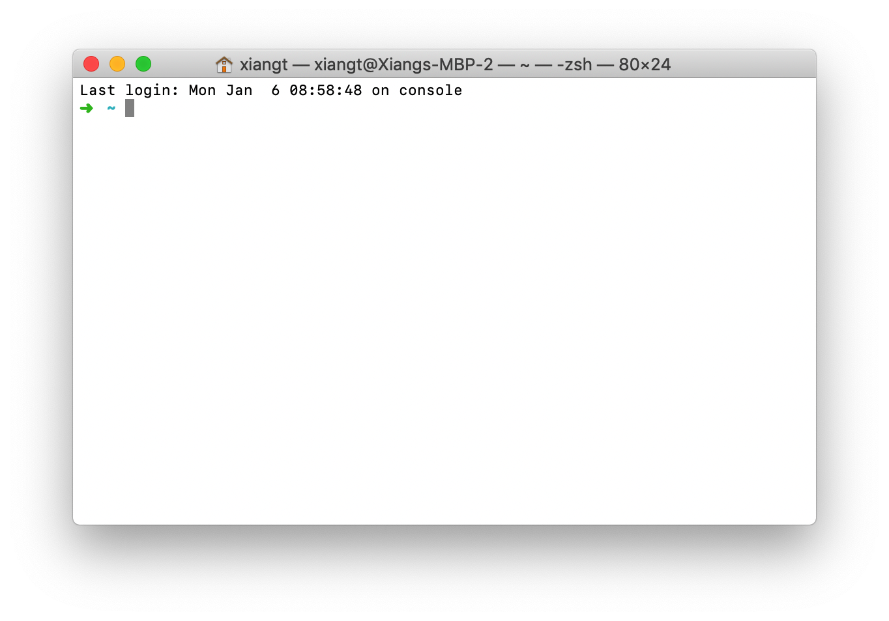</div>

- 新建&进入项目文件夹
```sh
mkdir yuzhuhwq5
cd yuzhuhwq5
```
<div style="text-align:center; margin:auto">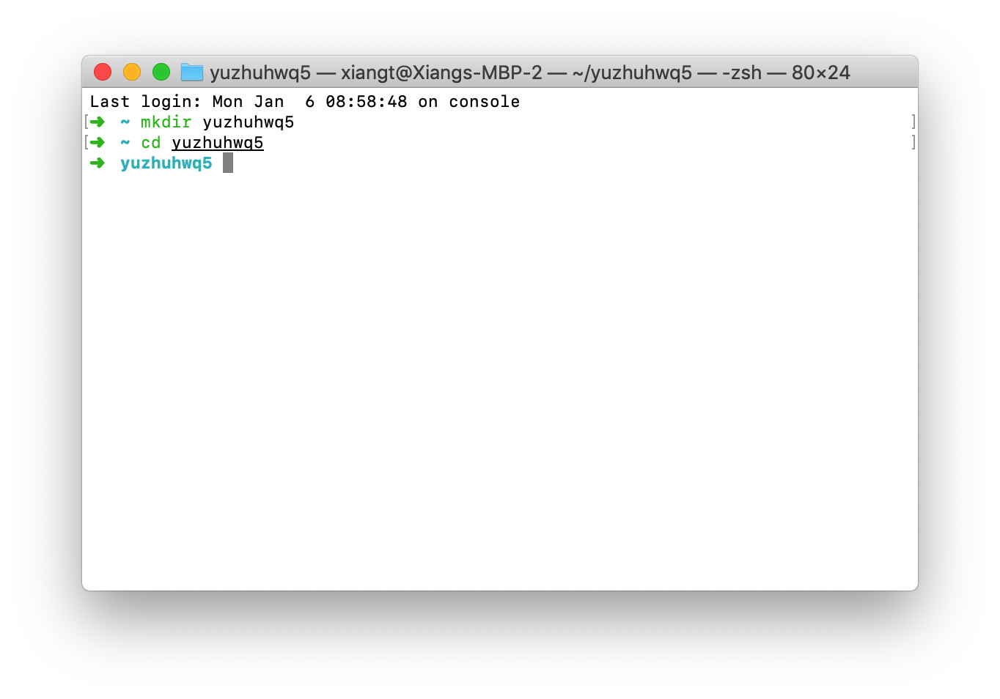</div>

- 在项目文件夹中，新建&进入包文件夹
```sh
mkdir yuzhuhwq5public
cd yuzhuhwq5public
```
<div style="text-align:center; margin:auto">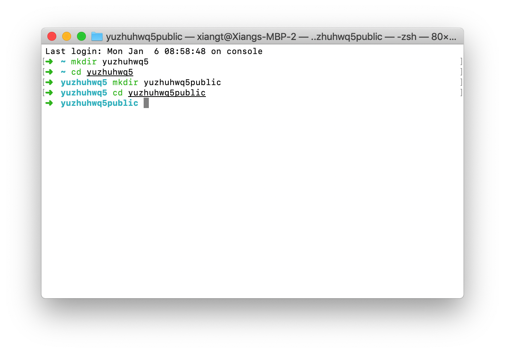</div>

- 创建核心文件
```sh
touch __init__.py bubbler.py
echo 'name="yuzhuwanghwq5bubbler"' >> yuzhuhwq5public/__init__.py
```
<div style="text-align:center; margin:auto">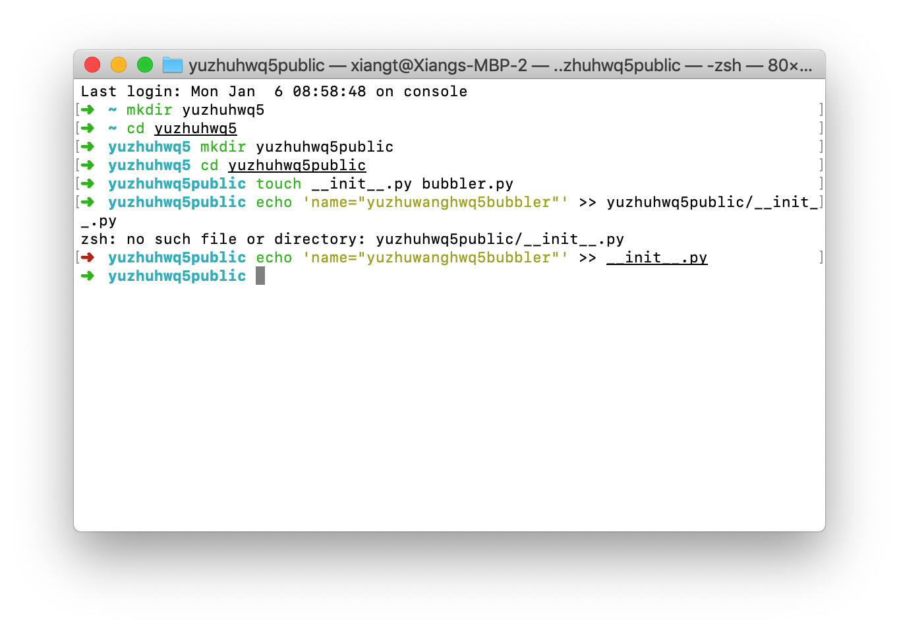</div>

- 编辑主文件 -  `bubbler.py`
```py
# 这里要提示一点：作业中有三个需求，这个只是打印了排序后的数组
def bubbleSort(arr):
    n = len(arr)
 
    # 遍历所有数组元素
    for i in range(n):
 
        # Last i elements are already in place
        for j in range(0, n-i-1):
 
            if arr[j] > arr[j+1] :
                arr[j], arr[j+1] = arr[j+1], arr[j]
 
# #testing
# arr = [31, 2, 11, 23, 8, 7, 11,14,20]
 
# bubbleSort(arr)
 
# print ("sorted:")
# for i in range(len(arr)):
#     print ("%d" %arr[i]),
```
- Create `LICENSE`
```license
MIT License

Copyright (c) 2020 Yuzhu Wang

Permission is hereby granted, free of charge, to any person obtaining a copy
of this software and associated documentation files (the "Software"), to deal
in the Software without restriction, including without limitation the rights
to use, copy, modify, merge, publish, distribute, sublicense, and/or sell
copies of the Software, and to permit persons to whom the Software is
furnished to do so, subject to the following conditions:

The above copyright notice and this permission notice shall be included in all
copies or substantial portions of the Software.

THE SOFTWARE IS PROVIDED "AS IS", WITHOUT WARRANTY OF ANY KIND, EXPRESS OR
IMPLIED, INCLUDING BUT NOT LIMITED TO THE WARRANTIES OF MERCHANTABILITY,
FITNESS FOR A PARTICULAR PURPOSE AND NONINFRINGEMENT. IN NO EVENT SHALL THE
AUTHORS OR COPYRIGHT HOLDERS BE LIABLE FOR ANY CLAIM, DAMAGES OR OTHER
LIABILITY, WHETHER IN AN ACTION OF CONTRACT, TORT OR OTHERWISE, ARISING FROM,
OUT OF OR IN CONNECTION WITH THE SOFTWARE OR THE USE OR OTHER DEALINGS IN THE
SOFTWARE.
```

- Create `README.MD`
```md
<!-- 这里你要自己添加包的使用说明 -->
## Bubbler
This is a sample package to sort an array using bubble sort.
```


### 上传到github
- 初始化
```sh
# 在yuzhuhwq5下
git init # 初始化git
git add -A && git commit -m 'init' # 添加到本地仓库
# 这里的粘贴在配置github最后记下的两行代码
git remote add origin git@github.com:GeekEast/yuzhuhwq5public.git
git push -u origin master
```
- 更新: 每次你对项目的任意文件改动都要执行这行，来上传到github
```sh
git add -A && git commit -m 'update' && git push
```

### 生成package
- 配置`setup.py`文件
```py
import setuptools

with open("README.md", "r") as fh:
    long_description = fh.read()

setuptools.setup(
    name="yuzhuhwq5public", # 这里填写package名字
    version="0.0.1",
    author="Yuzhu Wang", # 这里填写你的名字
    author_email="exmaple@example.com", # 填写你的邮箱
    description="A bubbler sort package",
    long_description=long_description,
    long_description_content_type="text/markdown",
    url="https://github.com/GeekEast/yuzhuhwq5public", #这里填写github仓库的地址
    packages=setuptools.find_packages(),
    classifiers=[
        "Programming Language :: Python :: 3",
        "License :: OSI Approved :: MIT License",
        "Operating System :: OS Independent",
    ],
)
```
- 生成package
```sh
# 在yuzhuhw5目录下
pip install virtualenv
virtualenv -p python3 .
source bin/activate
pip install --upgrade setuptools wheel
python3 setup.py sdist bdist_wheel
```
- 更新github
```sh
git add -A && git commit -m 'update' && git push
```
- 安装package
```sh
# 文件在dist下面
pip install <文件夹名>.tar.gz
```

### 发布package(可选，作业里用不到，光上传github就行)
```sh
# 在yuzhuhw5目录下
pip install --upgrade twine
twine upload dist/*
```


### 参考
- [How to Create and Publish Python Package.](https://dev.to/umeshdhakar/how-to-create-and-publish-python-package-62o)